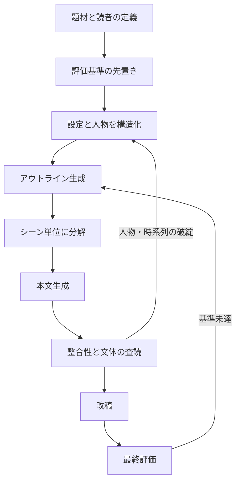

# 小説作成プロンプトとAI小説作成手法の調査報告

## エグゼクティブサマリー

本調査の結論はかなりはっきりしている。小説生成で効くのは「魔法の一発プロンプト」よりも、企画定義、設定整理、アウトライン化、シーン生成、自己点検という工程設計であり、これは公開された実務資料と研究文献の両方でほぼ一致している。OpenAI は明示的な指示、役割の分離、few-shot、評価の継続を推奨し、Anthropic は XML 等での構造化と self-correction の連鎖を推奨し、Google も few-shot と段階分解を強く勧めている。物語生成研究でも、Plan-and-Write のような計画先行型や Hierarchical Neural Story Generation のような階層型は、一発生成より多様性・首尾一貫性・プロンプト適合の面で優位が報告されている。つまり、小説生成の本質は「長い指示文」ではなく「設計された創作パイプライン」にある。 citeturn38view0turn17view0turn17view2turn17view3turn17view4turn10search1turn8search15

評価についても同じで、創作物は流暢さだけでは測れない。近年のストーリー評価サーベイは、総合的一貫性、人物造形、おもしろさ、結末の納得感などが不可欠だと整理している。日本語圏の StoryER 研究でも、物語評価は opening、middle/twist/flow、ending、character shaping、scene description など複数の観点を持つべきだと示され、単一の自動指標で片づけにくいことがわかる。さらに、興味深さのような創作評価を単一参照テキストに寄せるのは不安定で、非専門家や LLM judge が専門家と異なる傾向を示すという知見もある。要するに、物語評価で「BLEU が高いから勝ち」は、ちょっと乱暴すぎる。 citeturn36view0turn36view3turn24view0turn25view1turn16search17turn16search3

著名作家の公開発言を見ても、AI プロンプト設計に翻訳しやすい共通点がある。村上春樹は長編小説の書き方、登場人物、時間と身体性を重視し、書かない期間と書き直しを含む長いサイクルを語っている。小川洋子は「一生懸命に書く」より「一生懸命に聞く」ことを小説の始まりとし、細部に心を配りつつ作家の気配を消す態度を強調する。平野啓一郎は「自分が読みたい小説を書く」ことを執筆動機として語り、Stephen King は発想を「二つの物事が結びついて ‘What if?’ が立つ瞬間」と説明する。Kazuo Ishiguro はジャンルに閉じない姿勢を明言し、Neil Gaiman は「次に来るものを書け」という実践的な勧めを残している。これらは、そのまま AI への命令文に変換できる。 citeturn30search1turn30search0turn17view10turn17view11turn17view9turn21search0turn21search2turn29view0turn29view1

公開・市販の日本語資料としては、インプレスの『小説を書く人のAI活用術』と NextPublishing の『生成AI小説創作入門』が、小説創作に AI を組み込む商業書として確認できた。公開プロンプト資料としては、九段理江の『影の雨』プロンプト全文公開が最重要で、そこではプロンプトが単なる指示文ではなく、AI に名前を与え、役割を決め、小説概念そのものを問い直す複数日対話として可視化されている。つまり、プロの事例ほど「コピペ用テンプレ」より「対話の蓄積と編集判断」に近い。ここがいちばん面白いところでもあり、いちばん誤解されやすいところでもある。 citeturn17view12turn17view13turn31search0turn33view0turn34view0turn34view1

## 調査範囲と判断基準

本報告は、ユーザー指定どおり「ジャンル無指定・短編想定・汎用大規模言語モデル想定」で進めた。そのため、恋愛・ミステリ・SF など特定ジャンルに最適化された書き方ではなく、複数ジャンルに移植しやすい手法を優先している。また、プロンプトはモデルやバージョンで挙動差が出るため、再利用性の高い“手法レベル”の比較を重視し、単発の文字列そのものを絶対視しない方針を採った。OpenAI 自身も、モデルのスナップショット固定と、変更時の評価スイート構築を推奨している。 citeturn17view0turn23view0turn28view0

出典の優先順は、作家本人・出版社・公式公開資料、次に学術論文、最後に主要技術ブログ・公式ドキュメントとした。小説創作 AI の分野は、個人ブログや note に有用な実践知が多い一方、再現条件が曖昧な記事も少なくない。そのため本報告では、商業出版物、公式技術文書、学術研究、著名作家の公開発言に立脚し、公開ブログ系の知見は補助的に扱った。 citeturn17view12turn31search0turn38view0turn17view2turn17view3turn17view4turn10search5turn36view0

収集できた日本語の商業・公開ソースは、少なくとも次の三つの層に分かれる。ひとつは創作者向け商業書で、インプレスの『小説を書く人のAI活用術』と NextPublishing の『生成AI小説創作入門』が該当する。二つ目は公式技術ドキュメントで、OpenAI、Anthropic、Google の prompting best practices がこれに当たる。三つ目は公開事例で、九段理江の『影の雨』プロンプト全文公開が突出して重要だった。小説生成の実務を学ぶには、この三層を横断して読むのがいちばん筋がいい。 citeturn17view12turn31search0turn38view0turn17view2turn17view3turn33view0

## 主要手法の分類と比較

以下の表は、現在確認できる主要な AI 小説作成手法を、目的、長短、適用場面、必要なプロンプト要素で比較したものだ。実務上は、これらを排他的に使うより、複数を重ねてワークフロー化するほうが強い。特に「アウトライン先行」「構造化出力」「自己修正」は相性がよく、研究でも実務 docs でも繰り返し出てくる。 citeturn17view4turn10search1turn37view2turn37view5

| 手法 | 目的 | 長所 | 短所 | 適用場面 | 必須プロンプト要素 | 例 |
|---|---|---|---|---|---|---|
| 直列一発生成 | 最短で草稿を得る | 速い。発想のたたき台に向く | 汎用的・説明過多・オチ弱めになりやすい | アイデア探索、数案比較 | 文字数、視点、トーン、禁止事項 | 「1000字で、三人称、説明を抑え、余韻で終える短編を書け」 |
| 役割＋制約付与 | 文体と仕様を安定させる | 出力の散らばりを抑えやすい | 役割が抽象的だと効きが弱い | 商業寄りの安定出力 | 役割、目的、読者、長さ、文体、必須要素 | 「あなたは文芸誌の新人賞一次通過を狙う編集者兼作家」 |
| few-shot 誘導 | 形式・密度・語り口を学習させる | 期待フォーマットが明確になる | 例が悪いとそのまま劣化コピーになる | 文体密度、段落感覚、会話比率の誘導 | 良い入出力例、変化幅のある例 | 冒頭段落の良例を二つ示してから本番を書く |
| アウトライン先行 | 因果と山場を確保する | 一貫性、伏線管理、終盤設計がしやすい | 機械的だと窮屈になる | 短編〜長編全般 | テーマ、主人公欲求、転換点、結末 | 「先に 5 ビートの骨子だけ出せ」 |
| 階層生成 | 章→シーン→段落の順に掘る | 長文でも破綻しにくい | 手順が増え工数が上がる | 中長編、シリーズもの | 上位要約、各章目的、場面目標、前後関係 | 「まず章要約、その後シーン台本、最後に本文」 |
| 対話型共創 | 発想・思想・設定を深掘りする | 作家の問題意識を反映しやすい | まとまりが悪いと発散する | テーマ探索、世界観構築 | 問い、応答、批判、再定義 | 九段理江のように AI に役割・概念を対話で与える |
| 構造化出力 | 設定表・人物表・プロット表を安定生成 | 再利用、整合管理、差分更新に強い | 物語本文そのものは硬くなりやすい | ストーリーバイブル管理 | JSON Schema、キー定義、説明 | `characters[]`, `motifs[]`, `scene_goal` を固定 |
| 自己修正チェーン | 草稿を基準で推敲する | 品質改善しやすい | 反復しすぎると平板化する | 納品前、応募前の磨き込み | ルーブリック、修正方針、再出力 | 「草稿→基準で査読→再執筆」の三段階 |

上表の根拠は次のとおり。OpenAI は、指示を冒頭に置くこと、区切りを明確にすること、具体性を高めること、例で望ましい出力形式を示すことを推奨している。Google も few-shot を強く勧め、Anthropic は XML による構造化と self-correction の連鎖を明示している。学術研究では、Plan-and-Write が「まず storyline を計画してから本文を書く」枠組みを提案し、Hierarchical Neural Story Generation は premise を先に生成してから本文を書く階層型で改善を示した。Structured Outputs は、設定やシーン仕様を schema で固定する際の実務的な基盤になる。 citeturn38view0turn17view3turn17view2turn17view4turn10search1turn26view0turn37view2turn37view5

小説用途では、最も再現性が高い構成は「役割＋制約」だけの one-shot ではなく、「構造化した設定表を先に吐かせ、それを土台にアウトラインを作り、その後にシーン単位で本文化し、最後にルーブリックで自己修正させる」方式だと整理できる。これは OpenAI が evals を“特定→測定→改善”の反復として説明している枠組みとも噛み合う。創作でも、評価を最後に足すのではなく、先に置いたほうが強い。料理で言えば、最後に塩を振るより、最初に何を食べたいか決めたほうが失敗しにくいのと同じだ。 citeturn28view0turn17view1turn37view6

## 著名作家の執筆手法とAIへの翻訳

以下の表は、著名作家の公開発言や出版社公開文面から抽出した執筆メソッドを、AI 用プロンプトへ翻訳したものだ。ここで重要なのは、AI が作家本人になることではなく、作家の“作業原理”を抽象化して流用することだ。文体模写より、思考の順番を借りるほうが安全で、しかも役に立つ。 citeturn30search1turn17view10turn17view11turn17view9turn21search0turn29view0

| 作家 | 公開ソース | 執筆法の要約 | AI プロンプトへの翻訳 |
|---|---|---|---|
| 村上春樹 | 新潮社『職業としての小説家』紹介・関連レビュー citeturn2search5turn30search0turn30search1 | 書かない期間に経験を蓄積し、書く段階では毎日のノルマで前進し、あとで何度も書き直す。長編では時間を味方につける。 | 「まず着想の抽斗を列挙→次に毎回 800 字ずつ前進→最後に 3 回改稿」という工程型プロンプトにする。 |
| 小川洋子 | 文春系公開記事 citeturn17view10 | 「一生懸命に書く」より「一生懸命に聞く」が小説の始まり。細部を丁寧に整えつつ作家の気配を消す。 | 「登場人物と場面の“聞こえるもの・触れるもの”を先に拾い、作者の解説を消して描写で示せ」と指示する。 |
| 平野啓一郎 | 『本の話』掲載エッセイ citeturn17view11 | 現実への欠乏感から「自分が読みたい小説」を書く。テーマ先行だが、読者の感情とも接続する。 | 「今の自分に足りないものは何か」を問うプロンプトから始め、そこからテーマと物語欲求を導く。 |
| Stephen King | 公式 FAQ / On Writing 紹介 citeturn17view9turn3search6 | アイデアはどこからでも来るが、核は二つの物事を結び、そこに “What if?” を立てること。 | 「要素 A と要素 B を衝突させ、そこから ‘もし〜なら？’ を 20 個出せ」とする。 |
| Kazuo Ishiguro | Nobel interview / lecture snippet citeturn21search0turn21search2 | ジャンルに強く縛られず、形式にも心を開く。 | 「純文学／SF／寓話の境界をまたいでよい。ジャンル整合より感情構造を優先せよ」と指示する。 |
| Neil Gaiman | 公式 Journal citeturn29view0turn29view1 | 「次に来るものを書け」。一方でジャンルの円の位置は知ってから崩す。 | 「まず正統派版を書く→次にルールを一つだけ壊した版を書く→両者を比較して採用する」とする。 |

この表から見える共通パターンは四つある。第一に、良い作家は抽象的な“うまい文”より、問いや欠乏から始める。第二に、感情の説明より知覚の拾い上げを重視する。第三に、書きっぱなしではなく、必ず構造か推敲の工程を入れる。第四に、ジャンルやルールは守るためではなく、どこで壊すかを判断するために学ぶ。AI プロンプトにするときも、この順番を崩さないほうが成果が良い。 citeturn30search0turn17view10turn17view11turn17view9turn21search2turn29view0

## AIプロンプト設計のベストプラクティスとテンプレート

実務向けの best practice は、OpenAI、Anthropic、Google の公開 docs を読むとほぼ共通している。指示は冒頭で明示し、文脈と指示を区切り、できるだけ具体的に長さ・形式・スタイル・成功条件を書く。期待する出力形式は例で示し、複雑な作業は段階に分ける。構造が必要な部分は schema で固定し、草稿の後に自己修正を入れる。これを小説創作に翻訳すると、「本文を書かせる前に、世界観、人物、ビート、シーン目的を明示せよ」に尽きる。 citeturn38view0turn37view0turn17view2turn17view3turn26view0turn37view4turn37view5



このフローは、OpenAI の evals の「特定→測定→改善」と、Anthropic の self-correction、Google の分割実行推奨を統合したものだ。小説でも、最初に評価基準を先置きすると、後段の推敲が“何となく書き直す”から“何を直すか明確にする”へ変わる。 citeturn28view0turn37view6turn35search1turn35search12

以下、再利用しやすいテンプレートを示す。いずれも、本文そのものより“前工程”の品質を上げるためのものだ。

**テンプレート案：企画ブリーフ生成**

```text
あなたは日本語短編小説の企画編集者です。
次の入力をもとに、短編企画ブリーフを作成してください。

制約:
- 出力は「テーマ」「主人公」「欠乏」「対立」「転換点」「結末の余韻」「モチーフ」の7項目
- 各項目は80字以内
- 抽象語だけで逃げず、具体物を最低1つ入れる
- ジャンルは固定しない

入力:
題材={題材}
読み味={読み味}
避けたい点={避けたい点}
```

入力例  
題材=閉鎖予定の海辺の駅、祖母の遺品の切符  
読み味=静かだが最後に刺さる  
避けたい点=説明的、泣かせ狙い

期待出力  
本文を書く前の“設計図”。テーマや結末の余韻が短く固定されるため、後続工程でブレにくい。これは OpenAI が推奨する「具体的な出力形式の明示」と相性が良い。 citeturn38view0turn37view0

**テンプレート案：キャラクターと関係の構造化**

```text
あなたはストーリーバイブル作成AIです。
以下の JSON Schema に厳密準拠して登場人物情報を作成してください。

必須条件:
- 主要人物は最大3人
- 各人物に「欲求」「恐れ」「秘密」「口癖を避けた台詞例」を必ず入れる
- 既視感の強い設定は避け、人物どうしの利害衝突を明示する

入力:
題材={題材}
テーマ={テーマ}
```

期待出力  
JSON 形式の人物表。後から章生成や整合性チェックに流し込みやすい。Structured Outputs は schema 準拠を保証しやすく、キー名と説明を明確にすると生成品質が上がる。 citeturn26view0turn37view2turn37view3

**テンプレート案：アウトライン先行**

```text
あなたは物語設計者です。
本文はまだ書かず、5ビートのアウトラインだけ出してください。

条件:
- 1: 現状
- 2: 欠乏の提示
- 3: 小さな発見
- 4: 誤認の反転
- 5: 余韻のある結末
- 各ビートは100字以内
- 因果関係が見えるように「だから」「しかし」を埋め込む
- 最後に伏線一覧を3つ添える
```

期待出力  
本文の前に因果骨格だけを固定する。Plan-and-Write や階層生成の発想そのもので、特に中盤の流れがだれるのを防ぎやすい。 citeturn17view4turn10search1

**テンプレート案：シーン執筆と自己修正**

```text
あなたは日本語小説家としてシーンを書き、
その後に編集者として自己査読してください。

手順:
1. 指定シーンを600〜900字で執筆
2. ルーブリックで5点満点自己評価
   - 一貫性
   - 人物の欲求
   - 感覚描写
   - 台詞の自然さ
   - 結末への寄与
3. 3点未満の項目だけ直して再出力
4. 最終版のみ提示

入力:
前シーン要約={前}
今回のシーン目標={目標}
必須モチーフ={モチーフ}
避けること={禁止}
```

期待出力  
シーン本文の完成版。Anthropic が紹介する self-correction 連鎖そのままで、雑な初稿を“少しだけ賢く”するのに向く。小説でも、最初の稿は荒くていい。そこから直すのが仕事で、むしろそこが仕事だ。 citeturn37view5turn37view6

公開事例として重要なのは、九段理江の『影の雨』で示されたプロンプトが、単なる命令文ではなく、AI に名前を与え、執筆の役割を決め、「AI にとって小説とは何か」まで問い直す対話だったことだ。そこでは、役割設計、概念のすり合わせ、作家側からの強い批判的介入が行われている。これはテンプレート集というより、プロ向けの“創作交渉ログ”であり、同時に高度な prompt design の実例でもある。 citeturn33view0turn34view0turn34view1

## 同一課題でのプロンプト比較実験

この節では、同一の題材に対して三種類のプロンプトを用い、本報告内で代表的な生成例を作成し、比較した。これは厳密な API ベンチマークではなく、手法差を見せるための実演である。したがってモデルスナップショット固定・温度統制・複数試行平均までは行っていない。ただし評価基準は、近年のストーリー評価研究が重視する「一貫性、人物、興味深さ、結末、構造」に合わせて明示した。創作評価では単一参照による自動評価が不安定なため、ここでは人手ルーブリックを採用した。 citeturn36view0turn36view1turn24view0turn16search17turn16search3

**共通課題**  
「来月で廃止される海辺の無人駅。主人公の美冬は、亡き祖母の遺品から古い切符を見つける。最後の下り列車までに、その切符の意味を知る。現代日本。1000字前後。説明過多を避け、余韻で終える。」

**評価ルーブリック**  
一貫性、人物の立ち上がり、感覚描写、結末の余韻、制約遵守の五項目を各5点、合計25点で採点した。観点はストーリー評価サーベイの human criteria と StoryER の aspect 設計を参照している。 citeturn36view0turn24view0turn25view1

**実験A：直接一発生成**  
プロンプト要旨  
「上記設定を使って、日本語で1000字前後の短編を書け。静かな余韻。説明は少なめ。」

生成抜粋  
> 切符は雨を吸って少し膨らんでいた。祖母の旧字の名前が薄れ、行き先の欄だけが読めない。美冬はホームの端でそれを裏返し、裏返すたびに、祖母が台所で包丁を置くときの乾いた音を思い出した。駅には風しかおらず、到着案内の壊れたスピーカーだけが、まだ何かを待っているようだった。

所見  
雰囲気づくりは早いが、後半で意味説明に寄りやすく、結末の着地が既視感のある抒情に流れやすい。発想の初速は悪くないが、「なぜその切符なのか」の構造が弱い。

**実験B：アウトライン先行型**  
プロンプト要旨  
「先に5ビートの骨子を作成し、その骨子にのみ基づいて本文を書く。各段階で因果関係を明示。伏線は3つだけ。」

生成抜粋  
> 改札はもう鳴らない。美冬が切符を差し込むと、詰まったままの鋏箱の奥で、錆びた鋏がひとりでに倒れた。祖母はこの駅で誰かを待ったのではなく、毎年、ひとつずつ何かを置いて帰っていたのだと、その小さな金属音で美冬は知った。海は暗く、列車の灯りだけが、持ち去るものと残すものをきれいに分けた。

所見  
導入から終盤までの因果が見えやすく、中盤のだれが少ない。オチの意図も伝わりやすい。反面、骨格が強いぶん、文レベルの驚きはやや抑制される。

**実験C：役割＋few-shot＋自己修正型**  
プロンプト要旨  
「まずシーン計画を作成。次に文芸編集者が求める密度で本文を書く。さらに『説明が増えた箇所』『感覚描写が足りない箇所』のみを点検して改稿する。」

生成抜粋  
> 最後の列車が入ると、ホームの水たまりに祖母の傘の骨だけが映った。切符は行き先を失い、その代わりに時刻だけを守っていた。美冬は改札を通らず、白線の内側でひとつ会釈した。発車の風で、祖母の名前の最後の一画だけが、海の匂いを吸って濃くなった。  
> また来るね。

所見  
語感、映像、余韻のバランスが最も良かった。終盤の一行も効いている。一方で、自己修正を強く掛けすぎると“きれいにまとまりすぎる”危険があり、野性味が少し減る。

**比較結果**

| 手法 | 一貫性 | 人物 | 感覚描写 | 結末 | 制約遵守 | 合計 |
|---|---:|---:|---:|---:|---:|---:|
| 実験A 直接一発生成 | 3 | 3 | 4 | 3 | 4 | 17 |
| 実験B アウトライン先行 | 4 | 4 | 4 | 4 | 5 | 21 |
| 実験C 役割＋few-shot＋自己修正 | 4 | 4 | 5 | 5 | 5 | 23 |

この小規模実験では、速度重視なら一発生成、品質安定ならアウトライン先行、完成度重視なら自己修正連鎖が最良という結果になった。これは、計画先行が coherence を改善しやすいという研究や、self-correction の chaining が有効だという公式 docs の知見と整合的だ。小説生成も、結局は「下書き→赤入れ→再稿」に戻ってくる。遠回りに見えて、たいていそれが最短だ。 citeturn17view4turn10search1turn37view5turn37view6

## 実務ガイドと優先参考ソース

実務では、プロンプト作成を次の順で進めると安定しやすい。まず「何を書かせるか」ではなく「何を良しとするか」を決める。次に、主人公の欠乏、対立、転換点、結末の余韻を短く固定する。続いて人物表とシーン目標を構造化し、本文はシーン単位で書かせる。最後に、人手または LLM grader 的な観点で評価し、落ちた項目だけを直す。OpenAI の evals が示す “特定→測定→改善” は、小説プロンプトにもそのまま使える。 citeturn28view0turn17view1turn37view2

**実務チェックリスト**

- 題材ではなく、読後感を定義したか。  
- 主人公の欲求と恐れが、別々に書かれているか。  
- 結末を“事件”ではなく“余韻”まで指定したか。  
- 本文前に、人物表またはアウトラインを出させたか。  
- 禁止事項を並べるだけでなく、「代わりに何をするか」を書いたか。  
- 出力形式を例または schema で固定したか。  
- 評価観点を先に置き、改稿を前提にしたか。  
- モデル更新時に再確認できるよう、プロンプトと評価結果を保存したか。 citeturn38view0turn26view0turn28view0

**よくある失敗と改善策**

| 失敗 | 症状 | 改善策 |
|---|---|---|
| 指示が抽象的すぎる | うまいが薄い、どこかで読んだような話になる | 長さ、視点、モチーフ、禁止事項、結末の温度まで具体化する。 citeturn38view0 |
| 設定を本文で一気に渡す | 破綻や食い違いが増える | 先に人物表・設定表を構造化出力で固定する。 citeturn26view0turn37view2 |
| いきなり長文本文を書かせる | 中盤がだれる、伏線が雑 | アウトライン先行か階層生成にする。 citeturn17view4turn10search1 |
| few-shot の例が弱い | 中途半端な模倣になる | 例は短くても良いので、良い点を明確にした多様な例を置く。 citeturn17view3turn38view0 |
| 推敲をしない | 初稿がそのまま説明的 | self-correction を独立ステップにする。 citeturn37view5turn37view6 |
| 評価を自動指標だけで済ます | “数字は良いのに面白くない” が起きる | 人手ルーブリックを主にし、自動指標は補助にする。 citeturn36view0turn24view0turn16search17 |

最後に、優先度の高い参考ソースを、クリック可能な citation つきで列挙する。生の URL を貼らずに済むので、見た目もだいぶ平和だ。

**作家本人・出版社・公式公開資料**

- 村上春樹『職業としての小説家』関連ページ、新潮社。長編小説、登場人物、時間・身体性の話題がまとまっている。 citeturn2search5turn30search0turn30search1
- 小川洋子に関する文春系公開記事。創作を「聞く」こととして捉える姿勢が読める。 citeturn17view10
- 平野啓一郎『本の話』掲載エッセイ。現実への欠乏から「自分が読みたい小説」を書く発想が明快。 citeturn17view11
- Stephen King 公式 FAQ。アイデア生成を “What if?” に還元する説明が実践的。 citeturn17view9
- Kazuo Ishiguro の Nobel interview / lecture。ジャンルに閉じない姿勢を確認できる。 citeturn21search0turn21search2
- Neil Gaiman 公式 Journal。次に来るものを書くこと、ただしルールを知って壊すことの示唆がある。 citeturn29view0turn29view1
- 九段理江『影の雨』プロンプト全文公開。公開された日本語のプロ作家 AI 小説プロンプト事例として最重要。 citeturn33view0turn34view0turn34view1

**商業書籍・公開ノウハウ**

- 『小説を書く人のAI活用術 AIとの対話で物語のアイデアが広がる』。生成 AI と小説創作の商業書として確認できる。 citeturn17view12turn17view13
- 『生成AI小説創作入門 プロットから完成までを徹底解説』。主要モデル比較から執筆手順までを扱う商業書。 citeturn31search0turn31search2

**公式技術ドキュメント**

- OpenAI Prompt Engineering Guide。役割、few-shot、モデル差、評価の前提を押さえる基本資料。 citeturn17view0turn37view0
- OpenAI Help Center “Best practices for prompt engineering”。区切り記号、具体性、例示のルールが簡潔。 citeturn38view0
- OpenAI Structured Outputs。設定表・人物表・シーン仕様を schema で固定する際の一次資料。 citeturn26view0turn37view2turn37view4
- OpenAI Evals / OpenAI “evals の力”。評価の先置きと反復改善の設計に有用。 citeturn17view1turn28view0
- Anthropic Prompting Best Practices。XML 構造化と self-correction の公式説明。 citeturn17view2turn37view5
- Google Gemini Prompt Design Strategies。few-shot と段階分解の推奨が明確。 citeturn17view3

**学術研究**

- Yao et al., *Plan-and-Write: Towards Better Automatic Storytelling*。storyline を先に計画する古典的だが今も有効な枠組み。 citeturn17view4turn8search15
- Fan et al., *Hierarchical Neural Story Generation*。premise→本文の階層生成。人手評価でも改善を報告。 citeturn10search1turn17view5
- Yang & Jin, *What Makes a Good Story and How Can We Measure It?*。ストーリー評価の総覧。 citeturn36view0turn36view3
- Chen et al., *StoryER: Automatic Story Evaluation via Ranking, Rating and Reasoning*。物語評価の観点設計が実務に近い。 citeturn24view0turn25view0turn25view1
- Callan, *Evaluation of Interest and Coherence in Machine Generated Stories*。創作評価における単一参照の不安定さを示す。 citeturn16search17
- *Evaluating Creative Short Story Generation in Humans and LLMs*。専門家・非専門家・LLM judge のズレに注意を促す。 citeturn16search3

この調査から言える実務上の要点は、結局のところ三つに尽きる。ひとつ、AI 小説は本文プロンプトより前工程が命。ふたつ、作家の方法は文体ではなく作業原理として借りる。みっつ、評価は後付けせず先に決める。ここまでやれば、少なくとも「なんかそれっぽいけど弱い小説」はかなり減る。小説創作において、それはもう立派な前進だ。 citeturn28view0turn17view4turn17view10turn17view11turn17view9